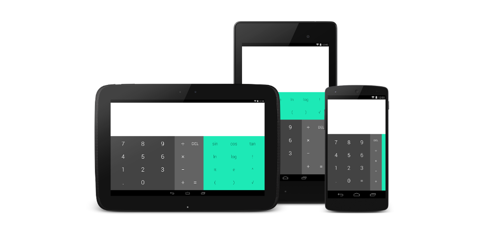
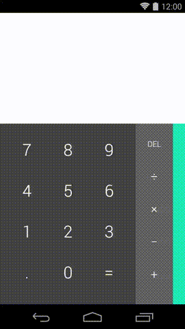

Material Calculator
===================

A backport of the recent redesign of the default calculator app shipped with Android Lollipop. Most of the material design goodness has been ported to work on all versions of the platform back to Android 2.3.3 (API Level 10). The source code was forked from the AOSP platform package.

Features that couldn't be backported include:

* Custom theme colors. Whatever is allowed by the the v7 appcompat library has been implemented
* Ripple drawables

Demo
====

The gif was recorded on a Android 4.4 KitKat device (API Level 19).

Sample Application
==================
The application has been published onto Google Play for easy access:

How to use this source code
===========================

The material-calculator project can be opened in Android Studio.

The folder structure is similar to the one in AOSP with the addition of the local gradle wrapper (gradlew). 

The project can be compiled from the command line using Gradle.

License
=======

    Copyright 2014 Rahul Parsani

    Licensed under the Apache License, Version 2.0 (the "License");
    you may not use this file except in compliance with the License.
    You may obtain a copy of the License at

       http://www.apache.org/licenses/LICENSE-2.0

    Unless required by applicable law or agreed to in writing, software
    distributed under the License is distributed on an "AS IS" BASIS,
    WITHOUT WARRANTIES OR CONDITIONS OF ANY KIND, either express or implied.
    See the License for the specific language governing permissions and
    limitations under the License.

Library licenses
================

__android-ui-1.2__ is subject to the [Apache License, Version 2.0][1]. More information on [the official web site][2].

__nineoldandroids-2.4.0__ is subject to the [Apache License, Version 2.0][1]. More information on [the official web site][3].

[1]: http://apache.org/licenses/LICENSE-2.0.html
[2]: https://github.com/markushi/android-ui
[3]: http://nineoldandroids.com